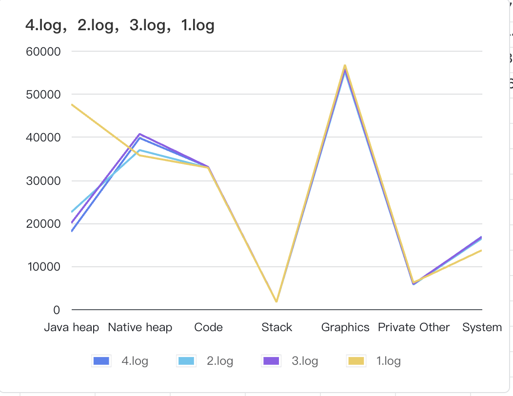
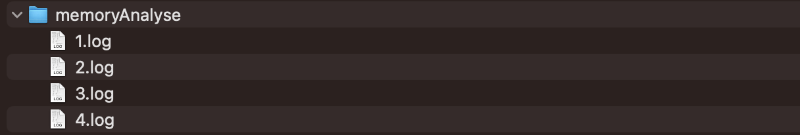
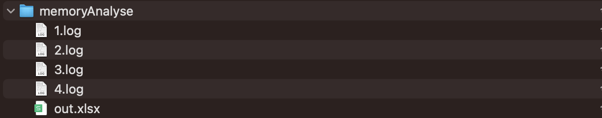

# MeminfoAnalyser
# 项目介绍

该项目主要用于解析 meminfo 信息，通过adb shell dumsys meminfo 获取的信息比较独立，如果把所有的meminfo 信息都手动分析放入excle 里面又会消耗大量无用时间，因此有了该脚本。该脚本可以分析一个目录下的 meminfo 信息，并将信息拆解到excle 中，通过excel 中的图表功能可以生成下图，轻松获取内存变化的趋势以及原因。



# 项目使用

### 1、获取 meminfo 信息

```
// 将抓取的meminfo 信息，抓取的时机根据需求把控,以下是wanAndroid 首页点击每个tab后的内存记录 
adb shell dumpsys meminfo com.goweii.wanandroid > memoryAnalyse/1.log
adb shell dumpsys meminfo com.goweii.wanandroid > memoryAnalyse/2.log
adb shell dumpsys meminfo com.goweii.wanandroid > memoryAnalyse/3.log
adb shell dumpsys meminfo com.goweii.wanandroid > memoryAnalyse/4.log
```



### 2、解析meminfo 信息

```
cd 到项目路径
python main.py memoryAnalys （目录路径）
```



### 3、打开excel 用图标功能生成折线图


通过上图可以轻松获取内存变化的趋势，帮助我们更好的定位问题。这里与python 的结合只是一个简单的例子。现实项目中可以做更个性化的定制，甚至加入预警，订阅等让整个监控操作变得更简单。

dumpsys meminfo 命令基本上是我排查内存问题最常用的工具， 它操作成本比较低，往往用于定位大概问题，确定排查的大概方向，后续再用其他工具进行排查。对dumpsys meminfo 有不理解或者想了解的内容欢迎讨论。